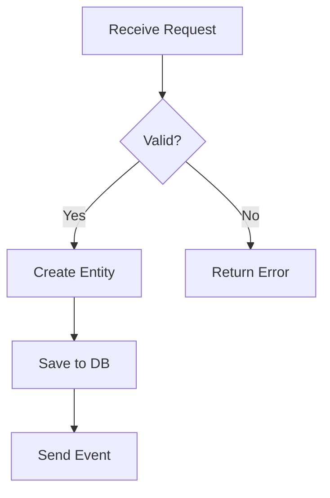
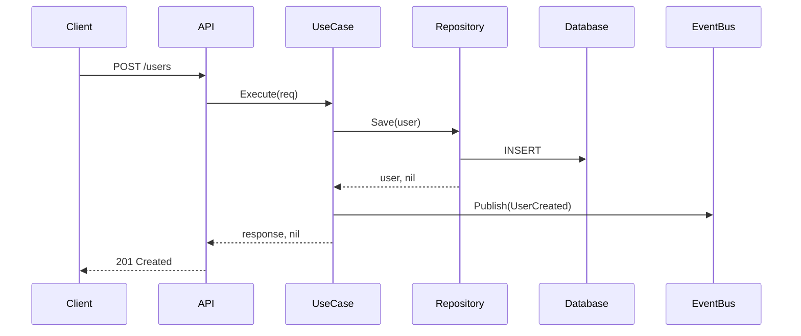
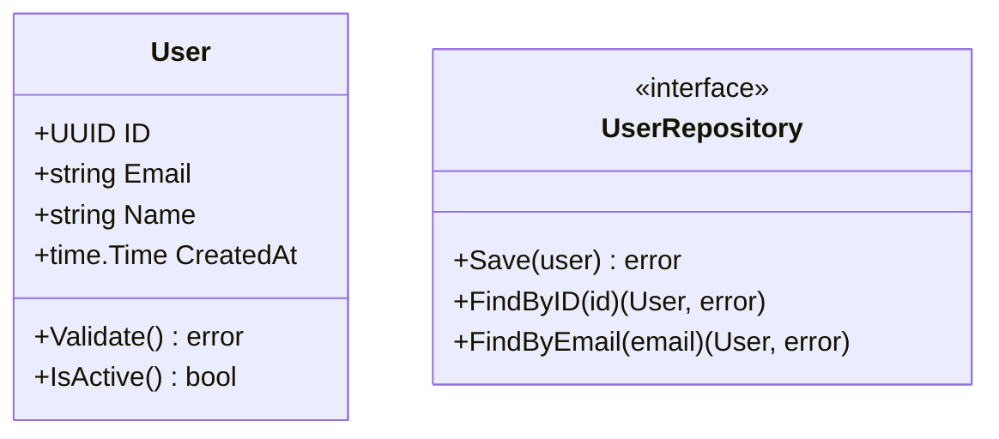
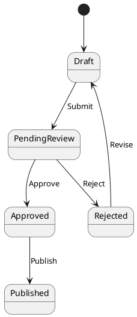

Generate a complete feature implementation from visual diagrams (Mermaid, PlantUML, or other graph representations).

**IMPORTANT - Code Quality:**
Before generating code, fetch the latest Uber Go Style Guide:
```
fetch_webpage("https://github.com/uber-go/guide/blob/master/style.md", "latest Go best practices")
```
This ensures all generated code follows current production standards.

## What This Skill Does

Converts visual representations (flowcharts, sequence diagrams, class diagrams, architecture diagrams) into working Go code following hexagonal architecture and TDD/BDD principles.

## Phase 1: Diagram Analysis

1. **Request the diagram** from the user:
   - Ask for Mermaid code, PlantUML, or description of the diagram
   - If it's an image or external file, ask them to paste the code
   - Accepted formats:
     - Mermaid (flowchart, sequence, class, state diagrams)
     - PlantUML
     - GraphViz DOT
     - Text description of flow/architecture

2. **Analyze the diagram** to extract:
   - **Entities/Aggregates**: What are the main domain objects?
   - **Use Cases/Operations**: What actions/operations are shown?
   - **Dependencies**: What repositories, services, or external systems are needed?
   - **Flow/Sequence**: What's the order of operations?
   - **Validations**: What business rules are implied?
   - **Error Cases**: What failure paths are shown?
   - **Data Flow**: What data moves between components?

3. **Clarify ambiguities** using AskUserQuestion:
   - Which bounded context/domain does this belong to?
   - What are the input/output types?
   - What validations are required beyond what's shown?
   - What error handling is needed?
   - Are there any missing edge cases?

## Phase 2: BDD Feature Definition

4. **Generate Godog feature file** based on the diagram:
   - Translate diagram flows into Gherkin scenarios
   - Create Given-When-Then steps
   - Include happy path and error scenarios
   - Use concrete examples with real data
   - Save to `features/[domain]/[feature_name].feature`

Example for sequence diagram:
```gherkin
Feature: User Registration
  As a system
  I want to register new users
  So that they can access the platform

  Scenario: Successful registration
    Given a valid email "user@example.com"
    And a valid password "SecureP@ss123"
    When I register the user
    Then the user should be created with ID
    And a welcome email should be sent
    And the response should be successful

  Scenario: Email already exists
    Given an existing user with email "existing@example.com"
    When I try to register with email "existing@example.com"
    Then I should receive an "email already exists" error
    And no new user should be created
```

5. **Review feature file** with user before proceeding

## Phase 3: Domain Layer (from diagram entities)

6. **Create domain entities** for each entity/aggregate in diagram:
   - Extract entity name and fields from class/entity diagrams
   - Identify value objects
   - Add business logic methods shown in flowcharts
   - Add validations implied by the diagram
   - Save to `internal/[domain]/domain/[entity].go`

7. **Create repository interfaces** (ports):
   - Extract persistence operations from sequence diagrams
   - Define methods based on data access patterns shown
   - Save to `internal/[domain]/domain/repository.go`

8. **Write domain unit tests**:
   - Test entity creation
   - Test business logic from flowchart nodes
   - Test validations
   - Save to `test/unit/[domain]/[entity]_test.go`

## Phase 4: Application Layer (from diagram flows)

9. **Create DTOs** from diagram inputs/outputs:
   - Extract request/response structures
   - Map diagram data to DTOs
   - Save to `internal/[domain]/application/dto/`

10. **Create use cases** from diagram operations:
    - Each main operation/action becomes a use case
    - Follow the sequence shown in sequence diagrams
    - Implement the workflow from flowcharts
    - Add error handling for alternative paths
    - Save to `internal/[domain]/application/usecase/[usecase]_usecase.go`

11. **Write use case tests**:
    - Mock repositories
    - Test workflows from diagram
    - Test error paths shown in diagram
    - Save to `test/unit/[domain]/[usecase]_test.go`

## Phase 5: BDD Step Definitions

12. **Create step definitions** matching the feature file:
    - Use modern Godog patterns (context.Context, TestSuite)
    - Map Given-When-Then to use case calls
    - Store test state in context
    - Save to `test/bdd/[domain]/[feature]_steps.go`

Example:
```go
package user_test

import (
    "context"
    "testing"

    "github.com/cucumber/godog"
)

type userTestSuite struct {
    email    string
    password string
    result   *dto.RegisterResponse
    err      error
}

func (s *userTestSuite) aValidEmail(ctx context.Context, email string) context.Context {
    s.email = email
    return ctx
}

func (s *userTestSuite) aValidPassword(ctx context.Context, password string) context.Context {
    s.password = password
    return ctx
}

func (s *userTestSuite) iRegisterTheUser(ctx context.Context) context.Context {
    // Call use case
    s.result, s.err = s.registerUseCase.Execute(ctx, dto.RegisterRequest{
        Email:    s.email,
        Password: s.password,
    })
    return ctx
}

func InitializeScenario(ctx *godog.ScenarioContext) {
    suite := &userTestSuite{}
    
    ctx.Step(`^a valid email "([^"]*)"$`, suite.aValidEmail)
    ctx.Step(`^a valid password "([^"]*)"$`, suite.aValidPassword)
    ctx.Step(`^I register the user$`, suite.iRegisterTheUser)
}

func TestFeatures(t *testing.T) {
    suite := godog.TestSuite{
        ScenarioInitializer: InitializeScenario,
        Options: &godog.Options{
            Format:   "pretty",
            Paths:    []string{"features"},
            TestingT: t,
        },
    }

    if suite.Run() != 0 {
        t.Fatal("non-zero status returned, failed to run feature tests")
    }
}
```

13. **Create test suite file**:
    - Save to `test/bdd/[domain]/suite_test.go`

## Phase 6: Infrastructure Layer (from diagram dependencies)

14. **Create repository implementations**:
    - Implement interfaces based on storage type in diagram
    - Add persistence logic
    - Save to `internal/[domain]/infrastructure/repository/[entity]_repository.go`

15. **Create adapters** for external services shown in diagram:
    - Email service, payment gateway, etc.
    - Save to `internal/[domain]/infrastructure/adapter/`

16. **Create HTTP/gRPC handlers** if shown in diagram:
    - Map endpoints to use cases
    - Handle request/response conversion
    - Save to `internal/[domain]/infrastructure/handler/`

## Phase 7: Integration & Dependency Injection

17. **Create dependency injection**:
    - Wire all components together
    - Follow diagram component relationships
    - Save to `internal/[domain]/infrastructure/di/container.go`

18. **Update or create main.go** if needed:
    - Initialize dependencies
    - Start server
    - Register routes

## Phase 8: Run Tests & Verify

19. **Run the tests**:
    ```bash
    # Unit tests
    go test ./test/unit/[domain]/... -v
    
    # BDD tests
    go test ./test/bdd/[domain]/... -v
    ```

20. **Verify implementation** matches the diagram

## Diagram Type Support

### Mermaid Flowchart


**Extracts:**
- Validation logic
- Entity creation
- Repository save operation
- Event publishing

### Mermaid Sequence Diagram


**Extracts:**
- HTTP handler
- Use case workflow
- Repository operations
- Event publishing
- Response codes

### Mermaid Class Diagram


**Extracts:**
- Entity structure
- Methods
- Repository interface

### PlantUML State Diagram


**Extracts:**
- State enum
- State transition methods
- Validation for transitions

## Code Quality Standards

All generated code must follow:
- ✅ Hexagonal architecture (ports and adapters)
- ✅ Domain-Driven Design principles
- ✅ Uber Go Style Guide (fetched dynamically)
- ✅ TDD/BDD approach (tests first)
- ✅ Modern Godog patterns (context.Context, TestSuite)
- ✅ Proper error handling (wrapping, naming)
- ✅ Interface verification (`var _ Interface = (*Type)(nil)`)
- ✅ Table-driven tests
- ✅ Defensive copying for slices/maps
- ✅ Defer for cleanup
- ✅ No panics in production code

## Output Structure

```
internal/[domain]/
├── domain/
│   ├── [entity].go           # From diagram entities
│   ├── repository.go         # From diagram dependencies
│   └── errors.go             # Domain errors
├── application/
│   ├── dto/
│   │   ├── request.go        # From diagram inputs
│   │   └── response.go       # From diagram outputs
│   └── usecase/
│       └── [usecase].go      # From diagram flows
└── infrastructure/
    ├── repository/
    │   └── [entity]_repo.go  # Implements ports
    ├── adapter/              # External services from diagram
    └── handler/              # HTTP/gRPC from diagram

test/
├── unit/[domain]/            # Domain & application tests
└── bdd/[domain]/             # Feature tests
    ├── [feature]_steps.go
    └── suite_test.go

features/[domain]/
└── [feature].feature         # From diagram flows
```

## Example Usage

```
User: /from-diagram