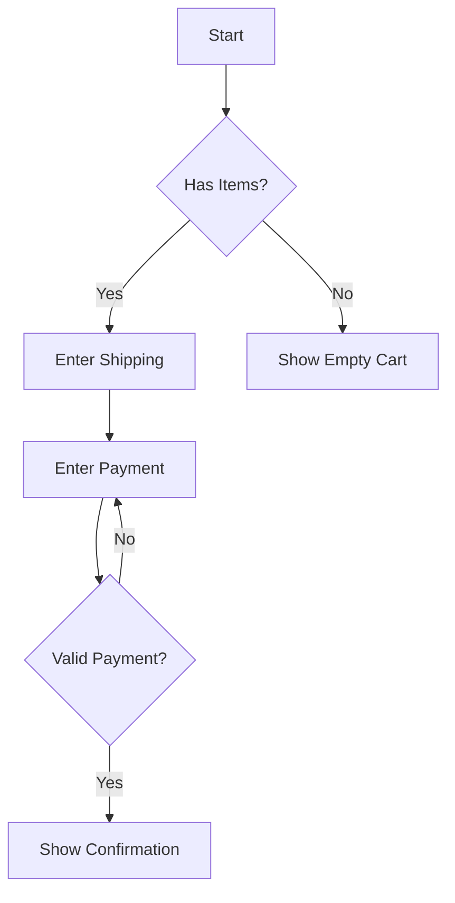
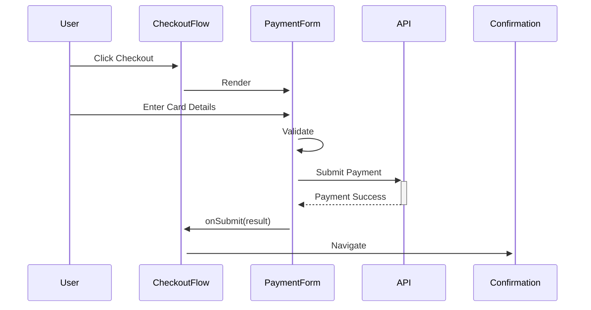
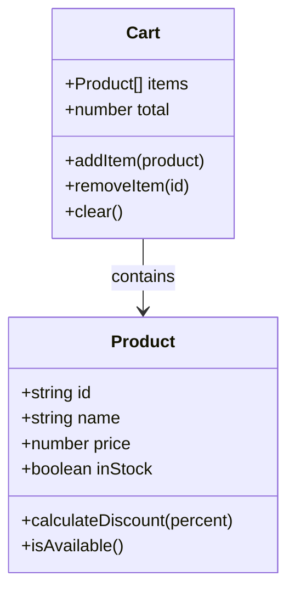
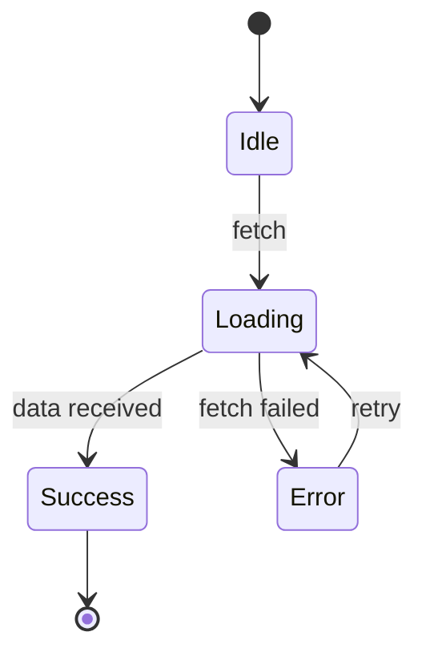
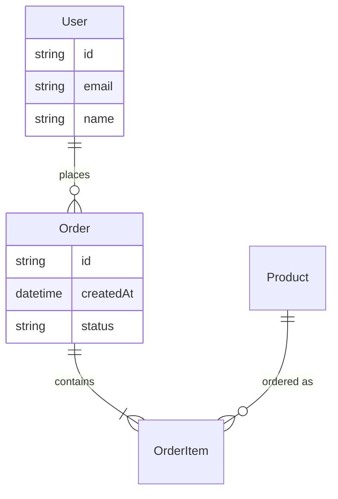
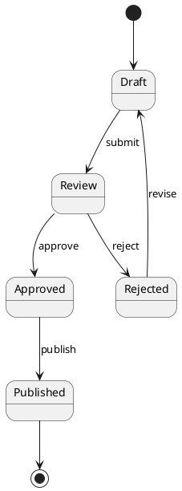
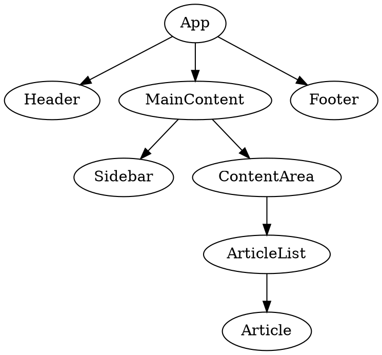

Generate complete React feature implementation from visual diagrams (Mermaid, PlantUML, GraphViz).

## What This Skill Does

Converts visual diagrams into production-ready React components with TypeScript, tests, and Storybook stories. Intelligently maps diagram structures to React patterns:

- **Flowcharts** → Component hierarchy with conditional rendering
- **Sequence diagrams** → Component interactions and prop flow
- **Class diagrams** → TypeScript interfaces and component structure
- **State diagrams** → State machines with useReducer
- **ER diagrams** → TypeScript types and data models

## Phase 1: Diagram Collection

1. **Request diagram from user** using interactive questions:

   **Question 1: Diagram Type**
   - Mermaid (flowchart, sequence, class, state, ER)
   - PlantUML (class, sequence, usecase, state)
   - GraphViz (directed graphs, component diagrams)

   **Question 2: Diagram Source**
   - Ask user to paste the diagram code OR
   - Provide file path to read

   **Question 3: Target Feature Name**
   - What should this feature be called?
   - Example: "payment-flow", "user-journey", "shopping-cart"
   - Must be kebab-case

   **Question 4: Generate Tests?**
   - Yes/No (default: Yes)
   - If yes, generate comprehensive Vitest tests

   **Question 5: Generate Storybook Stories?**
   - Yes/No (default: Yes)
   - If yes, generate stories for all components

2. **Read the diagram** (if file path provided) or accept pasted diagram code

## Phase 2: Diagram Analysis

3. **Analyze diagram structure** to extract:

   **From Flowcharts:**
   - Nodes → React components or UI states
   - Edges → Component relationships or data flow
   - Decision nodes → Conditional rendering logic
   - Start/End → Entry/exit points

   **From Sequence Diagrams:**
   - Participants → React components
   - Messages → Props and callbacks
   - Activations → Component state changes
   - Return values → Callback payloads

   **From Class Diagrams:**
   - Classes → TypeScript interfaces or component types
   - Attributes → Interface properties or component props
   - Methods → Component methods or hooks
   - Relationships → Composition or prop dependencies

   **From State Diagrams:**
   - States → State machine states (useReducer)
   - Transitions → Actions in reducer
   - Events → User interactions or effects
   - Guards → Conditional state transitions

   **From ER Diagrams:**
   - Entities → TypeScript interfaces
   - Attributes → Interface properties
   - Relationships → Data associations
   - Cardinality → Array types or optional properties

4. **Identify React patterns needed:**
   - Component hierarchy (parent/child relationships)
   - State management (useState vs useReducer vs Context)
   - Side effects (useEffect, data fetching)
   - Event handlers (user interactions)
   - Conditional rendering (based on state/props)
   - Lists and iterations (mapping over data)
   - Forms and validation (if input nodes detected)

5. **Clarify ambiguities** with user:
   - What styling framework? (default: Tailwind CSS)
   - What form library? (default: React Hook Form if forms detected)
   - What data fetching? (default: fetch API)
   - Any external dependencies needed?
   - Accessibility requirements beyond WCAG 2.1 AA?

## Phase 3: Type System Generation

6. **Generate TypeScript types FIRST** in `types/index.ts`:

   **From diagram entities:**
   ```tsx
   // Entity types from class/ER diagrams
   export interface User {
     id: string;
     name: string;
     email: string;
     role: UserRole;
   }

   export type UserRole = 'admin' | 'user' | 'guest';

   // State types from state diagrams
   export type CheckoutState =
     | 'cart'
     | 'shipping'
     | 'payment'
     | 'confirmation';

   // Event/Action types for state machines
   export type CheckoutAction =
     | { type: 'NEXT_STEP' }
     | { type: 'PREVIOUS_STEP' }
     | { type: 'UPDATE_SHIPPING'; payload: ShippingInfo }
     | { type: 'SUBMIT_PAYMENT'; payload: PaymentInfo };

   // Component props from sequence diagrams
   export interface PaymentFormProps {
     onSubmit: (data: PaymentInfo) => void;
     onCancel: () => void;
     isLoading?: boolean;
   }

   // Data flow types from flowcharts
   export interface ValidationResult {
     isValid: boolean;
     errors?: ValidationError[];
   }
   ```

7. **Map diagram relationships to type relationships:**
   - Inheritance → Type unions or interfaces extending
   - Composition → Nested types
   - Associations → Reference properties
   - Aggregation → Array properties

## Phase 4: Test-Driven Development (TDD)

8. **Generate FAILING tests BEFORE implementation:**

   **A. Component Tests** (for each identified component):
   ```tsx
   // components/PaymentForm.test.tsx
   import { describe, it, expect, vi } from 'vitest';
   import { render, screen } from '@testing-library/react';
   import userEvent from '@testing-library/user-event';
   import { axe, toHaveNoViolations } from 'jest-axe';
   import { PaymentForm } from './PaymentForm';

   expect.extend(toHaveNoViolations);

   describe('PaymentForm', () => {
     it('renders payment form fields', () => {
       render(<PaymentForm onSubmit={vi.fn()} onCancel={vi.fn()} />);
       expect(screen.getByLabelText(/card number/i)).toBeInTheDocument();
       expect(screen.getByLabelText(/expiry date/i)).toBeInTheDocument();
       expect(screen.getByLabelText(/cvv/i)).toBeInTheDocument();
     });

     it('calls onSubmit with form data when valid', async () => {
       const onSubmit = vi.fn();
       const user = userEvent.setup();

       render(<PaymentForm onSubmit={onSubmit} onCancel={vi.fn()} />);

       await user.type(screen.getByLabelText(/card number/i), '4242424242424242');
       await user.type(screen.getByLabelText(/expiry date/i), '12/25');
       await user.type(screen.getByLabelText(/cvv/i), '123');

       await user.click(screen.getByRole('button', { name: /submit/i }));

       expect(onSubmit).toHaveBeenCalledWith({
         cardNumber: '4242424242424242',
         expiryDate: '12/25',
         cvv: '123',
       });
     });

     it('should have no accessibility violations', async () => {
       const { container } = render(<PaymentForm onSubmit={vi.fn()} onCancel={vi.fn()} />);
       const results = await axe(container);
       expect(results).toHaveNoViolations();
     });
   });
   ```

   **B. Hook Tests** (if state machine or complex logic):
   ```tsx
   // hooks/useCheckoutFlow.test.ts
   import { describe, it, expect } from 'vitest';
   import { renderHook, act } from '@testing-library/react';
   import { useCheckoutFlow } from './useCheckoutFlow';

   describe('useCheckoutFlow', () => {
     it('initializes with cart state', () => {
       const { result } = renderHook(() => useCheckoutFlow());
       expect(result.current.currentState).toBe('cart');
     });

     it('transitions through states in sequence', () => {
       const { result } = renderHook(() => useCheckoutFlow());

       act(() => result.current.nextStep());
       expect(result.current.currentState).toBe('shipping');

       act(() => result.current.nextStep());
       expect(result.current.currentState).toBe('payment');

       act(() => result.current.nextStep());
       expect(result.current.currentState).toBe('confirmation');
     });

     it('prevents invalid state transitions', () => {
       const { result } = renderHook(() => useCheckoutFlow());

       act(() => result.current.previousStep());
       expect(result.current.currentState).toBe('cart'); // Still cart, can't go back
     });
   });
   ```

   **C. State Machine Tests** (for state diagrams):
   ```tsx
   // state/checkoutReducer.test.ts
   import { describe, it, expect } from 'vitest';
   import { checkoutReducer, initialState } from './checkoutReducer';

   describe('checkoutReducer', () => {
     it('handles NEXT_STEP action', () => {
       const state = checkoutReducer(initialState, { type: 'NEXT_STEP' });
       expect(state.currentStep).toBe('shipping');
     });

     it('handles UPDATE_SHIPPING action', () => {
       const shippingInfo = { address: '123 Main St', city: 'NYC' };
       const state = checkoutReducer(initialState, {
         type: 'UPDATE_SHIPPING',
         payload: shippingInfo,
       });
       expect(state.shippingInfo).toEqual(shippingInfo);
     });
   });
   ```

   **D. Utility Tests** (for helper functions):
   ```tsx
   // utils/validators.test.ts
   import { describe, it, expect } from 'vitest';
   import { validateCardNumber, validateExpiryDate } from './validators';

   describe('validators', () => {
     describe('validateCardNumber', () => {
       it('validates correct card number', () => {
         expect(validateCardNumber('4242424242424242')).toBe(true);
       });

       it('rejects invalid card number', () => {
         expect(validateCardNumber('1234')).toBe(false);
       });
     });
   });
   ```

   **ALL TESTS MUST FAIL** - This is RED phase of TDD.

## Phase 5: Component Implementation (GREEN)

9. **Generate component hierarchy** based on diagram:

   **For Flowcharts:**
   - Main container component
   - Node components for each flowchart node
   - Conditional rendering based on state

   ```tsx
   // components/CheckoutFlow.tsx
   import { useState } from 'react';
   import type { CheckoutState } from '../types';
   import { CartStep } from './CartStep';
   import { ShippingStep } from './ShippingStep';
   import { PaymentStep } from './PaymentStep';
   import { ConfirmationStep } from './ConfirmationStep';

   export function CheckoutFlow() {
     const [currentStep, setCurrentStep] = useState<CheckoutState>('cart');

     const renderStep = () => {
       switch (currentStep) {
         case 'cart':
           return <CartStep onNext={() => setCurrentStep('shipping')} />;
         case 'shipping':
           return <ShippingStep
             onNext={() => setCurrentStep('payment')}
             onBack={() => setCurrentStep('cart')}
           />;
         case 'payment':
           return <PaymentStep
             onNext={() => setCurrentStep('confirmation')}
             onBack={() => setCurrentStep('shipping')}
           />;
         case 'confirmation':
           return <ConfirmationStep />;
       }
     };

     return (
       <div className="checkout-flow">
         <nav aria-label="Checkout progress">
           <ol className="flex space-x-4">
             <li className={currentStep === 'cart' ? 'font-bold' : ''}>Cart</li>
             <li className={currentStep === 'shipping' ? 'font-bold' : ''}>Shipping</li>
             <li className={currentStep === 'payment' ? 'font-bold' : ''}>Payment</li>
             <li className={currentStep === 'confirmation' ? 'font-bold' : ''}>Confirmation</li>
           </ol>
         </nav>

         <main className="mt-8">
           {renderStep()}
         </main>
       </div>
     );
   }
   ```

   **For State Diagrams:**
   - Generate useReducer-based state machine

   ```tsx
   // hooks/useCheckoutFlow.ts
   import { useReducer } from 'react';
   import type { CheckoutState, CheckoutAction } from '../types';

   interface State {
     currentStep: CheckoutState;
     shippingInfo: ShippingInfo | null;
     paymentInfo: PaymentInfo | null;
   }

   const initialState: State = {
     currentStep: 'cart',
     shippingInfo: null,
     paymentInfo: null,
   };

   function reducer(state: State, action: CheckoutAction): State {
     switch (action.type) {
       case 'NEXT_STEP':
         return { ...state, currentStep: getNextStep(state.currentStep) };
       case 'PREVIOUS_STEP':
         return { ...state, currentStep: getPreviousStep(state.currentStep) };
       case 'UPDATE_SHIPPING':
         return { ...state, shippingInfo: action.payload };
       case 'SUBMIT_PAYMENT':
         return { ...state, paymentInfo: action.payload };
       default:
         return state;
     }
   }

   export function useCheckoutFlow() {
     const [state, dispatch] = useReducer(reducer, initialState);

     return {
       currentState: state.currentStep,
       shippingInfo: state.shippingInfo,
       paymentInfo: state.paymentInfo,
       nextStep: () => dispatch({ type: 'NEXT_STEP' }),
       previousStep: () => dispatch({ type: 'PREVIOUS_STEP' }),
       updateShipping: (info: ShippingInfo) =>
         dispatch({ type: 'UPDATE_SHIPPING', payload: info }),
       submitPayment: (info: PaymentInfo) =>
         dispatch({ type: 'SUBMIT_PAYMENT', payload: info }),
     };
   }
   ```

   **For Sequence Diagrams:**
   - Generate component with callback props
   - Map message flow to prop callbacks

   ```tsx
   // components/PaymentForm.tsx
   import { useForm } from 'react-hook-form';
   import type { PaymentFormProps, PaymentInfo } from '../types';

   export function PaymentForm({ onSubmit, onCancel, isLoading }: PaymentFormProps) {
     const { register, handleSubmit, formState: { errors } } = useForm<PaymentInfo>();

     return (
       <form onSubmit={handleSubmit(onSubmit)} className="space-y-4">
         <div>
           <label htmlFor="cardNumber" className="block text-sm font-medium">
             Card Number
           </label>
           <input
             {...register('cardNumber', { required: 'Card number is required' })}
             id="cardNumber"
             type="text"
             className="mt-1 block w-full rounded border-gray-300"
             aria-invalid={errors.cardNumber ? 'true' : 'false'}
             aria-describedby={errors.cardNumber ? 'cardNumber-error' : undefined}
           />
           {errors.cardNumber && (
             <p id="cardNumber-error" className="mt-1 text-sm text-red-600" role="alert">
               {errors.cardNumber.message}
             </p>
           )}
         </div>

         <div className="flex space-x-4">
           <button
             type="button"
             onClick={onCancel}
             className="px-4 py-2 border border-gray-300 rounded hover:bg-gray-50"
             disabled={isLoading}
           >
             Cancel
           </button>
           <button
             type="submit"
             className="px-4 py-2 bg-blue-500 text-white rounded hover:bg-blue-600 disabled:opacity-50"
             disabled={isLoading}
             aria-busy={isLoading}
           >
             {isLoading ? 'Processing...' : 'Submit Payment'}
           </button>
         </div>
       </form>
     );
   }
   ```

   **For Class Diagrams:**
   - Generate TypeScript interfaces
   - Create components matching class structure

   ```tsx
   // types/index.ts (from class diagram)
   export interface Product {
     id: string;
     name: string;
     price: number;
     category: ProductCategory;
     inStock: boolean;

     // Methods become utility functions or component methods
     calculateDiscount(percentage: number): number;
     isAvailable(): boolean;
   }

   export type ProductCategory = 'electronics' | 'clothing' | 'books';

   // utils/product.ts
   export function calculateDiscount(product: Product, percentage: number): number {
     return product.price * (1 - percentage / 100);
   }

   export function isAvailable(product: Product): boolean {
     return product.inStock;
   }
   ```

10. **Generate supporting utilities:**
    - Validators (from decision nodes or guards)
    - Formatters (for display logic)
    - State helpers (for state transitions)

    ```tsx
    // utils/validators.ts
    export function validateCardNumber(cardNumber: string): boolean {
      return /^\d{16}$/.test(cardNumber.replace(/\s/g, ''));
    }

    export function validateExpiryDate(expiry: string): boolean {
      const [month, year] = expiry.split('/').map(Number);
      const now = new Date();
      const expiryDate = new Date(2000 + year, month - 1);
      return expiryDate > now;
    }
    ```

11. **Run tests - should now PASS (GREEN phase)**

## Phase 6: Storybook Stories (if requested)

12. **Generate stories for each component:**

    ```tsx
    // components/PaymentForm.stories.tsx
    import type { Meta, StoryObj } from '@storybook/react';
    import { fn } from '@storybook/test';
    import { PaymentForm } from './PaymentForm';

    const meta = {
      title: 'Features/Checkout/PaymentForm',
      component: PaymentForm,
      parameters: {
        layout: 'centered',
      },
      tags: ['autodocs'],
      args: {
        onSubmit: fn(),
        onCancel: fn(),
      },
    } satisfies Meta<typeof PaymentForm>;

    export default meta;
    type Story = StoryObj<typeof meta>;

    export const Default: Story = {
      args: {
        isLoading: false,
      },
    };

    export const Loading: Story = {
      args: {
        isLoading: true,
      },
    };

    export const WithInitialData: Story = {
      args: {
        defaultValues: {
          cardNumber: '4242424242424242',
          expiryDate: '12/25',
        },
      },
    };
    ```

    **Generate stories showing:**
    - All states from state diagrams
    - All transitions/interactions
    - Error states
    - Loading states
    - Edge cases

## Phase 7: Public API & Documentation

13. **Create feature index.ts:**

    ```tsx
    // index.ts
    export { CheckoutFlow } from './components/CheckoutFlow';
    export { PaymentForm } from './components/PaymentForm';
    export { CartStep } from './components/CartStep';

    export { useCheckoutFlow } from './hooks/useCheckoutFlow';

    export type {
      CheckoutState,
      CheckoutAction,
      PaymentInfo,
      ShippingInfo,
      PaymentFormProps,
    } from './types';
    ```

14. **Generate README.md with:**
    - Feature overview
    - Component documentation
    - State machine diagram (for state-based features)
    - Usage examples
    - Accessibility notes
    - Testing instructions

15. **Create diagram-to-code mapping document:**

    ```markdown
    # Diagram Mapping

    ## Original Diagram

    \`\`\`mermaid
    [Include original diagram here]
    \`\`\`

    ## Mapping to React Components

    | Diagram Element | React Implementation |
    |----------------|---------------------|
    | Cart Node | CartStep component |
    | Shipping Node | ShippingStep component |
    | Payment Node | PaymentStep component |
    | Confirmation Node | ConfirmationStep component |
    | Transitions | State machine with useReducer |
    | Validations | Form validation with React Hook Form |

    ## Component Hierarchy

    \`\`\`
    CheckoutFlow (container)
    ├── CartStep
    │   ├── CartItem (repeated)
    │   └── CartSummary
    ├── ShippingStep
    │   └── ShippingForm
    ├── PaymentStep
    │   └── PaymentForm
    └── ConfirmationStep
        └── OrderSummary
    \`\`\`

    ## State Flow

    [Explain how state flows through the components based on diagram]
    ```

## Diagram Type Handlers

### Mermaid Flowchart

**Input:**


**Output:**
- Container component with step navigation
- Conditional rendering for decision nodes
- State management for flow control
- Components for each process node
- Validation logic for decision points

### Mermaid Sequence Diagram

**Input:**


**Output:**
- Components for each participant
- Props/callbacks for messages
- Loading states for async operations
- Error handling for failed responses
- State updates for return values

### Mermaid Class Diagram

**Input:**


**Output:**
- TypeScript interfaces for classes
- Utility functions for methods
- Component props derived from attributes
- Context or hook for Cart management
- Type-safe operations

### Mermaid State Diagram

**Input:**


**Output:**
- useReducer with state machine
- Action types for transitions
- Guards for conditional transitions
- Loading/error UI states
- Retry mechanisms

### Mermaid ER Diagram

**Input:**


**Output:**
- TypeScript interfaces for entities
- Relationship types (arrays, references)
- Cardinality reflected in types (optional, array)
- API service types
- Form types for data entry

### PlantUML State Diagram

**Input:**


**Output:**
- State enum type
- Reducer with transition actions
- Guards for valid transitions
- UI for each state
- Action buttons triggering transitions

### GraphViz Component Diagram

**Input:**


**Output:**
- Component file structure
- Parent-child composition
- Props flow based on edges
- Layout components
- Container/presentational split

## Code Quality Standards

All generated code MUST follow:

**TypeScript Standards:**
- ✅ Strict mode enabled
- ✅ No `any` types
- ✅ Explicit return types for functions
- ✅ Proper null/undefined handling
- ✅ Discriminated unions for state

**React Standards:**
- ✅ Functional components only
- ✅ Named exports only
- ✅ Props interfaces exported
- ✅ Hooks rules followed
- ✅ No inline styles (use Tailwind)

**Accessibility Standards:**
- ✅ WCAG 2.1 AA compliance
- ✅ Semantic HTML
- ✅ ARIA labels and roles
- ✅ Keyboard navigation
- ✅ Focus management
- ✅ Screen reader support
- ✅ Form error announcements

**Testing Standards:**
- ✅ 80%+ component coverage
- ✅ 100% hook coverage
- ✅ User-centric tests (React Testing Library)
- ✅ Accessibility tests (jest-axe)
- ✅ No implementation details testing

**Architecture Standards:**
- ✅ Feature-based organization
- ✅ Separation of concerns
- ✅ Single responsibility
- ✅ Public API via index.ts
- ✅ Documentation in README.md

## Output Structure

```
src/features/[feature-name]/
├── components/
│   ├── [Component].tsx
│   ├── [Component].test.tsx
│   └── [Component].stories.tsx    # If requested
├── hooks/
│   ├── use[Feature].ts
│   └── use[Feature].test.ts
├── context/                        # If state machine needed
│   ├── [Feature]Context.tsx
│   └── [Feature]Context.test.tsx
├── services/                       # If API calls in diagram
│   ├── [feature]Service.ts
│   └── [feature]Service.test.ts
├── types/
│   └── index.ts
├── utils/
│   ├── validators.ts              # If validation logic
│   ├── validators.test.ts
│   ├── formatters.ts              # If display logic
│   └── formatters.test.ts
├── index.ts                       # Public API
├── README.md                      # Feature docs
└── DIAGRAM_MAPPING.md            # Diagram to code mapping
```

## Workflow Summary

1. **Collect Diagram** - Ask user for diagram type, source, feature name, test/story preferences
2. **Analyze Diagram** - Extract entities, relationships, flow, patterns
3. **Generate Types** - Create TypeScript interfaces from diagram structure
4. **Write Tests (RED)** - Generate comprehensive failing tests
5. **Implement Components (GREEN)** - Generate code to pass tests
6. **Generate Stories** - Create Storybook stories (if requested)
7. **Document Feature** - Create README and mapping docs
8. **Verify Quality** - Ensure all standards met, tests pass, a11y compliant

## Example Usage

```
User: /from-diagram